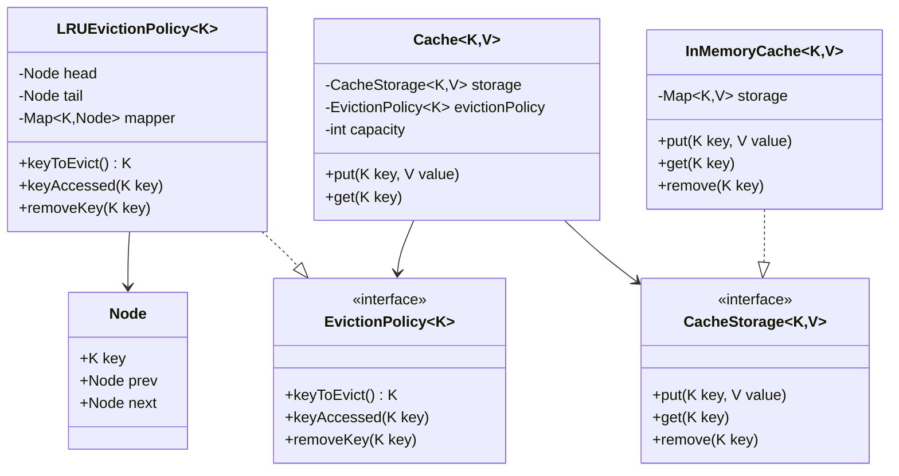

# Cache System - Class Diagram

## System Design

## Design Patterns Used
1. Strategy Pattern: For different eviction policies
2. Factory Pattern: Could be used for creating different types of caches
3. Template Method: For implementing cache operations
4. Adapter Pattern: Could be used for adapting different storage systems

## Implementation Steps
1. Define the EvictionPolicy interface with key operations
2. Implement LRUEvictionPolicy with doubly linked list
3. Create CacheStorage interface for storage operations
4. Implement InMemoryCache with HashMap storage
5. Build main Cache class with eviction and storage
6. Add capacity management and eviction logic
7. Implement thread-safety mechanisms
8. Add error handling for edge cases
9. Implement cache statistics tracking
10. Add support for different value types
