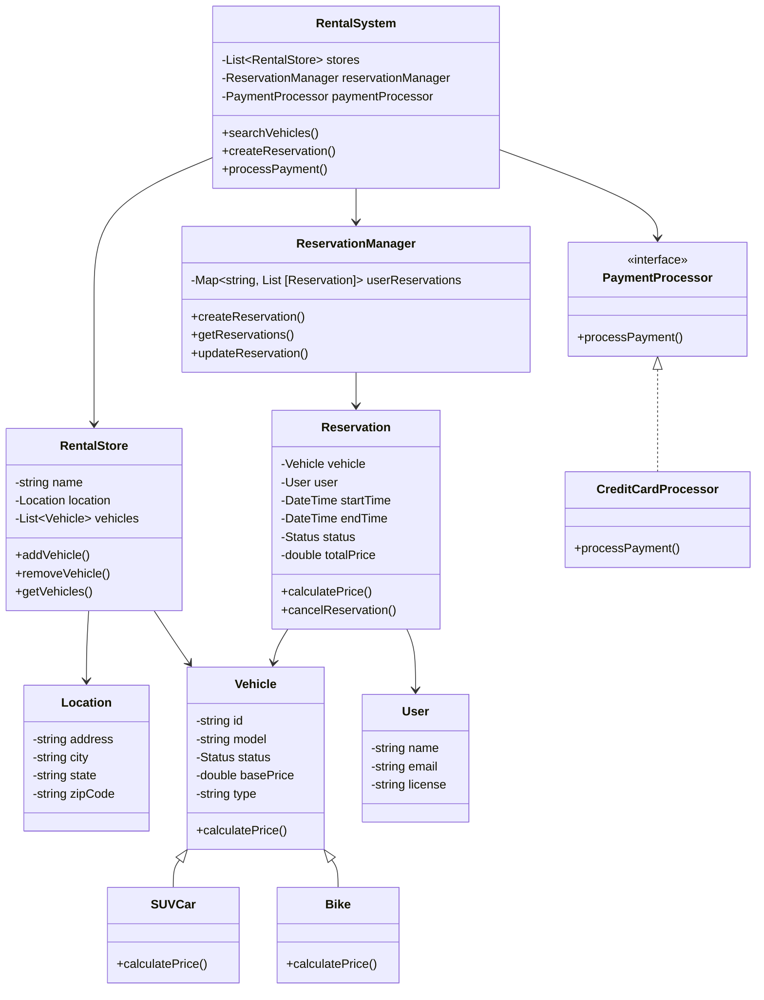

# Car Rental System - Class Diagram

## System Design

## Design Patterns Used
1. Strategy Pattern: For payment processing
2. Factory Pattern: For vehicle creation
3. Observer Pattern: For reservation status updates
4. Command Pattern: For reservation operations
5. Singleton: For ReservationManager

## Implementation Steps
1. Create Vehicle hierarchy with different types
2. Implement Location and RentalStore management
3. Build User and authentication system
4. Create Reservation system with status tracking
5. Implement ReservationManager for booking handling
6. Add payment processing with strategy pattern
7. Create main RentalSystem class
8. Implement vehicle search and filtering
9. Add pricing calculation logic
10. Implement reservation workflows
