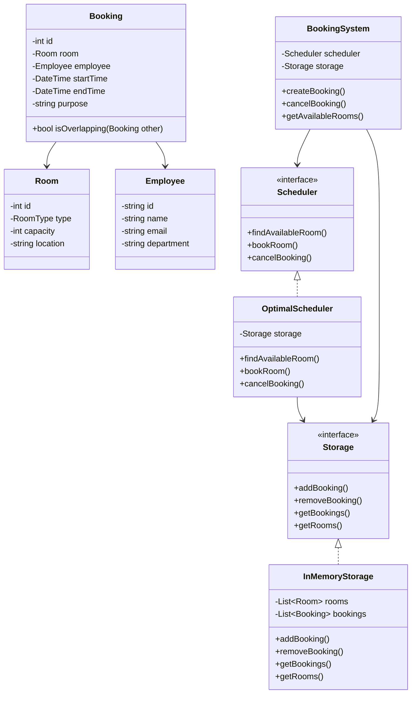

# Employee Conference Booking System - Class Diagram

## System Design

## Design Patterns Used
1. Strategy Pattern: For scheduling algorithms
2. Factory Pattern: For creating rooms and bookings
3. Singleton: For BookingSystem
4. Observer: For booking notifications
5. Repository: For storage abstraction

## Implementation Steps
1. Create Room and Employee entities
2. Implement Booking class with validation
3. Define Storage interface and implementation
4. Create Scheduler interface
5. Implement OptimalScheduler with logic
6. Build BookingSystem with dependencies
7. Add conflict resolution
8. Implement notification system
9. Add booking constraints
10. Create reporting functionality
