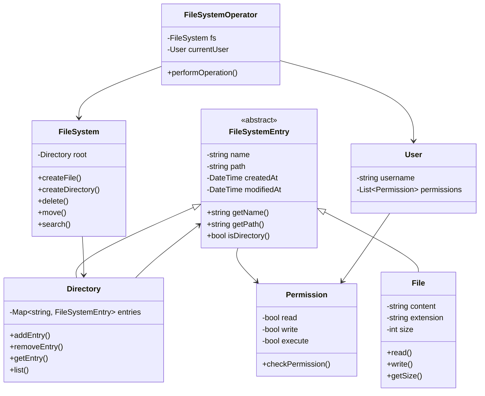

# File System - Class Diagram

## System Design

## Design Patterns Used
1. Composite Pattern: For file/directory structure
2. Factory Pattern: For creating files and directories
3. Command Pattern: For file operations
4. Strategy Pattern: For different file operations
5. Observer: For file system changes

## Implementation Steps
1. Create base FileSystemEntry class
2. Implement File and Directory classes
3. Build main FileSystem class
4. Add permission system
5. Implement user management
6. Create file operations
7. Add path resolution
8. Implement search functionality
9. Add file system operators
10. Implement error handling
