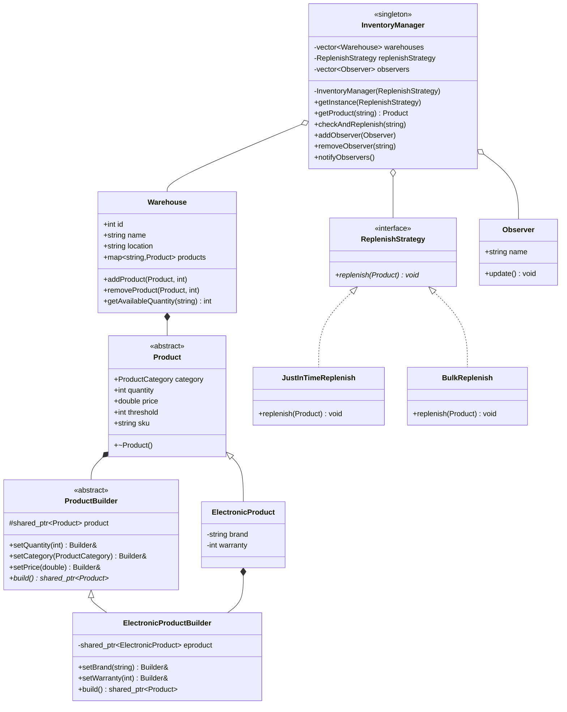

# Inventory Management System - Class Diagram

## Design Patterns Used

1. **Builder Pattern**
   - Used for constructing Product objects
   - Separate builders for different product types
   - Allows step-by-step construction with method chaining

2. **Strategy Pattern**
   - Used for different replenishment strategies
   - Easily swap between JustInTime and Bulk replenishment

3. **Observer Pattern**
   - Used to notify stakeholders about inventory changes
   - Observers can subscribe/unsubscribe to notifications

4. **Singleton Pattern**
   - InventoryManager is a singleton
   - Ensures single point of control for inventory

## Implementation Steps

1. **Product System**
   - `enum class ProductCategory`
   - `class Product` (abstract)
     - Base attributes (sku, quantity, price)
   - `class ElectronicProduct : public Product`
     - Additional attributes (brand, warranty)

2. **Builder Pattern**
   - `class Product::Builder` (abstract)
     - Common builder methods
   - `class ElectronicProduct::Builder`
     - Product-specific builder methods
     - Build implementation

3. **Warehouse System**
   - `class Warehouse`
     - `addProduct(Product*, int)`
     - `removeProduct(Product*, int)`
     - `getAvailableQuantity(string)`

4. **Replenishment Strategy**
   - `class ReplenishStrategy` (interface)
     - `virtual void replenish(Product*)`
   - `class JustInTimeReplenish`
   - `class BulkReplenish`

5. **Observer System**
   - `class Observer`
     - `update()`
   - Observer registration in InventoryManager
   - Notification mechanism

6. **Inventory Management**
   - `class InventoryManager` (singleton)
     - `getInstance()`
     - `checkAndReplenish()`
     - Observer management
     - Warehouse management
