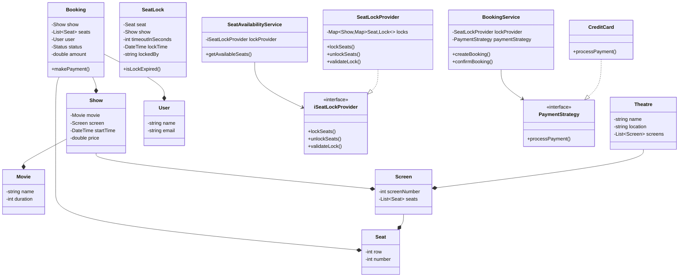

# Movie Booking System - Class Diagram

## System Design

## Design Patterns Used
1. Strategy Pattern: For payment processing (PaymentStrategy interface)
2. Singleton: Could be used for BookingService and SeatLockProvider
3. Observer: Could be used to notify users about show updates
4. Factory: Could be used for creating different types of seats/shows

## Implementation Steps
1. Create base entities (Movie, Seat, Screen, Theatre)
2. Implement Show management with schedules
3. Create User and Booking classes with states
4. Implement SeatLockProvider for concurrent booking handling
5. Add SeatAvailabilityService for real-time seat status
6. Create BookingService with payment integration
7. Implement payment processing strategy
8. Add concurrency control for seat booking
9. Implement booking timeout and auto-cancellation
10. Add validation and error handling
