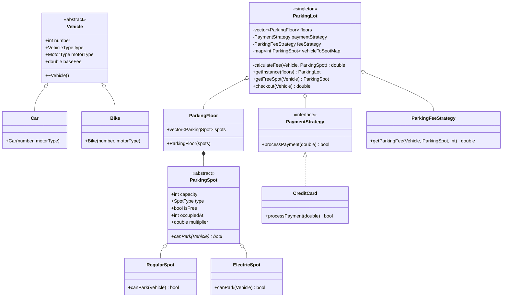

# Parking Lot System - Class Diagram

## Design Patterns Used

1. **Singleton Pattern**
   - ParkingLot is a singleton
   - Ensures single point of control for the parking system

2. **Strategy Pattern**
   - PaymentStrategy for different payment methods
   - ParkingFeeStrategy for fee calculation

3. **Factory Pattern**
   - Vehicle creation using factory method

## Implementation Steps

1. **Enums & Base Classes**
   - `enum class VehicleType {CAR, BIKE}`
   - `enum class MotorType {FUEL, ELECTRIC}`
   - `enum class SpotType {REGULAR, ELECTRIC}`

2. **Vehicle Hierarchy**
   - `class Vehicle` (abstract)
     - Constructor with number, type, motorType, baseFee
   - `class Car : public Vehicle`
   - `class Bike : public Vehicle`

3. **Parking Spot Types**
   - `class ParkingSpot` (abstract)
     - `virtual bool canPark(Vehicle*)`
   - `class RegularSpot : public ParkingSpot`
   - `class ElectricSpot : public ParkingSpot`

4. **Payment System**
   - `class PaymentStrategy` (interface)
     - `virtual bool processPayment(double)`
   - `class CreditCard : public PaymentStrategy`
   - `class ParkingFeeStrategy`
     - `double calculateFee(Vehicle*, duration)`

5. **Parking Management**
   - `class ParkingFloor`
     - `vector<ParkingSpot*> spots`
   - `class ParkingLot` (singleton)
     - `getInstance()`
     - `getFreeSpot(Vehicle*)`
     - `checkout(Vehicle*)`
     - Track vehicle-to-spot mapping

6. **Main Flow**
   - Create parking structure
   - Get ParkingLot instance
   - Park vehicle (getFreeSpot)
   - Process payment
   - Checkout vehicle
