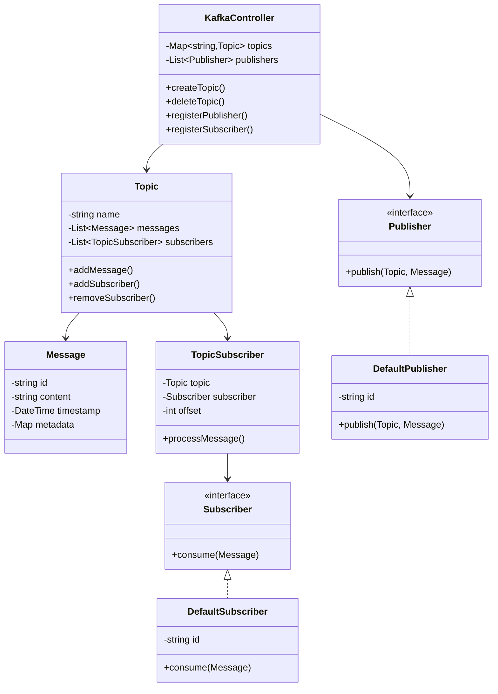

# Pub/Sub System - Class Diagram

## System Design

## Design Patterns Used
1. Observer Pattern: For pub/sub mechanism
2. Factory Pattern: For creating topics and messages
3. Strategy Pattern: For message processing
4. Singleton: For KafkaController

## Implementation Steps
1. Create Message and Topic entities
2. Implement Publisher interface
3. Create Subscriber interface
4. Build TopicSubscriber for management
5. Implement KafkaController
6. Add message queuing
7. Implement offset tracking
8. Add error handling
9. Create delivery guarantees
10. Implement scaling mechanisms
