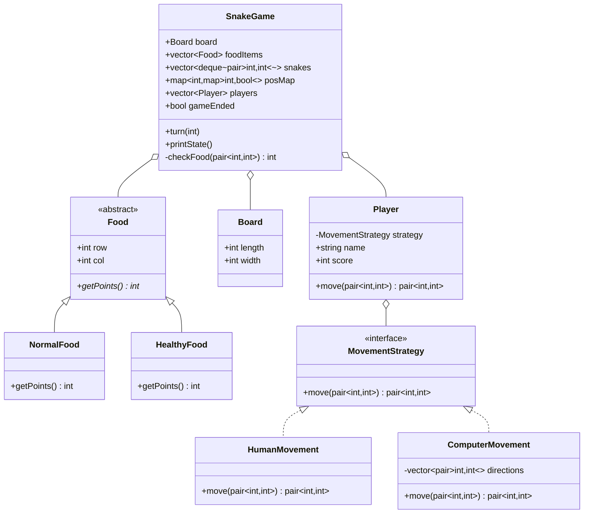

# Snake Game - Class Diagram

## Design Patterns Used

1. **Strategy Pattern**
   - MovementStrategy for different movement types
   - Easy to add new movement patterns

2. **Factory Pattern**
   - Food creation with different types

## Implementation Steps

1. **Base Classes & Enums**
   - `class Food` (abstract)
     - `virtual int getPoints()`
   - `class Board`
     - Constructor with length, width

2. **Food Types**
   - `class NormalFood : public Food`
     - Define points value
   - `class HealthyFood : public Food`
     - Define higher points value

3. **Movement System**
   - `class MovementStrategy` (interface)
     - `virtual pair<int,int> move(pair<int,int>)`
   - `class HumanMovement`
     - Implement WASD/arrow key movement
   - `class ComputerMovement`
     - Implement random/AI movement

4. **Player Management**
   - `class Player`
     - Track score
     - Hold movement strategy
     - Handle movement input

5. **Game Engine**
   - `class SnakeGame`
     - `turn(int playerId)`
     - `checkCollision(pair<int,int>)`
     - `updateSnake(Player*, pair<int,int>)`
     - `checkFood(pair<int,int>)`
     - Manage game state

6. **Main Flow**
   - Initialize board and food
   - Create players with strategies
   - Game loop with turns
   - Handle collisions and food
   - Update scores
