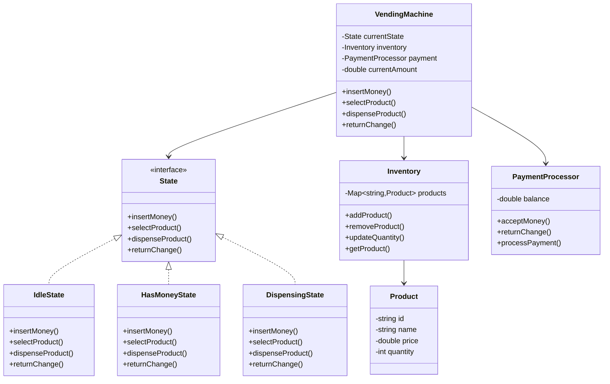

# Vending Machine - Class Diagram

## System Design

## Design Patterns Used
1. State Pattern: For vending machine states
2. Factory Pattern: For product creation
3. Singleton: For vending machine
4. Strategy Pattern: For payment processing

## Implementation Steps
1. Create Product and Inventory classes
2. Implement State interface
3. Create concrete states
4. Build PaymentProcessor
5. Implement VendingMachine controller
6. Add money handling
7. Implement product selection
8. Create dispensing logic
9. Add change calculation
10. Implement error handling
